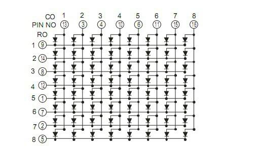

# Candy Queen Embedathon

---
## Milestone 1: How we got the values from esp32's NVS

### Step 1. EXTRACTING NVS DATA USING HEX EDITOR
1. First install [esptool.py](https://docs.espressif.com/projects/esptool/en/latest/esp32/) 
```python 
pip install esptool
```
2. Get the whole firmware that was loaded onto the esp32-id ;)
```bash
python -m esptool --port COM6 read_flash 0x0 0x400000 firmware_backup.bin
```
```bash
python -m esptool --port COM6 write_flash 0x0 firmware_backup.bin
```

3. Reading the firmware:
Using a hex editor like [hxd](https://mh-nexus.de/en/hxd/), we could view the whole firmware and things written to it.

Here is what we found:


### Step 2. Converting the bin data to a usable format
#### Method 1: USING ESP32 IDF:
1. Setup esp32 idf using [setup](https://docs.espressif.com/projects/esp-idf/en/stable/esp32/get-started/index.html#installation)
2. Create your project and replace main.c with <b>[this](final_task\milestone1\scripts\esp32idf\main.c)</b> file.
3. Run the [commands](final_task/esp32idf/commands.md) 

This is the output we receive:

```bash
Keys in namespace 'Passwords':
Key: line0, Type: 33
Value (string): �?=18141312131254144313133
Key: line1, Type: 33
Value (string): �?=1711131213131415111313121312131
Key: line2, Type: 33
Value (string): �?=16131211141314141312131213121
Key: line3, Type: 33
Value (string): �?=16131225541413124313133
Key: line4, Type: 33
Value (string): �?=1652111413141452111413161
Key: line5, Type: 33
Value (string): �?=1613121213131414131212131312131
Key: line6, Type: 33
Value (string): �?=521312131213141413121313343
Done listing keys and values.
```

#### Method 2: Using Preference Library

Using this [code](final_task\milestone1\scripts\read_data\read_data.ino) we could read the value from NVS.

```bash
Stored value for line0: �?=18141312131254144313133
Stored value for line1: �?=1711131213131415111313121312131
Stored value for line2: �?=16131211141314141312131213121
Stored value for line3: �?=16131225541413124313133
Stored value for line4: �?=1652111413141452111413161
Stored value for line5: �?=1613121213131414131212131312131
Stored value for line6: �?=521312131213141413121313343
```

##### Code
```cpp
#include <Preferences.h>
Preferences preferences;
void setup() {
  Serial.begin(115200);
  if (preferences.begin("Passwords", true)) { // 'true' is for read only mode
   
    for (int i = 0; i <= 6; i++) {
      String key = "line" + String(i); 
      String storedValue = preferences.getString(key.c_str(), "default_value"); 
      Serial.println("Stored value for " + key + ": " + storedValue);
    }
  } else {
    Serial.println("Failed to open preferences.");
  }
  preferences.end();
}
void loop() {
}
```

---
## Milestone 2: How we sent to and decrypted the message on another PC

### Step 1. (Sort of) Manual Decryption

From the Problem Statement Document:
```
A mysterious sequence of digits, such as 13125216175, has
been transmitted by the ESP32. It appears to encode a hidden
visual pattern.
The sequence alternates between two roles, guiding the
structure of the pattern.
Your task is to interpret these numbers and reconstruct the
encoded representation.
```

- `visual pattern` indicated that there was definitely use of plotting techniques 
- `The sequence alternates between two roles, guiding the
structure of the pattern.` This meant we needed to alternate between the two symbols here we took as `*` and ` `
- For the even index we used `*` and ` ` for odd index
- We used the pattern for each line and got the outut ***LAKHTARUS*** which is the reverse of **SURATHKAL**
- So now we know to expect LAKHTARUS on the receiving computer.

### Step 2. Actually sending the data to the second PC
#### a. ESP32
- On the ESP we have a websocket running which takes the Key values from NVS of the ESP and converts it to readable format using the Preferences library.
- It then sends the data to the computer which decrypts it.
- **[This](final_task/milestone2/transmit_password_websocket/transmit_password_websocket.ino)** is the code which does this.

#### b. Receiving PC
- On the Receiving PC we have a python script which has 2 main functionalities.
- First part of the script deals with receiving the data from the websocket. Once it's received it, it stores it in a string and prints out that string for verification purposes.
- Second part of the script deals with decrypting the data received from the websocket. Once we have stored the received data in a string, we parse through it and print `*` and ` ` according to the rules established in manual decryption part.
- Upon performing this action, this is the output received.

#### c. Running the code
**[This](/final_task/milestone2/receive.py)** is the code which performs all this. To run this code follow the following steps:

  1. Change the ssid and password in transmit_password_websocket to the ssid and password of your network.
  2. Upload the code in transmit_password_websocket onto your ESP32.
  3. Press the reset button on your ESP32
  4. Clone the repo to a location of your choice on the receiving pc and change directory to that location
  5. Run `/final_task/milestone2/receive.py`

#### d. Output


https://github.com/user-attachments/assets/2d24559f-222d-41d2-809e-943fc90f1c7d


---
## Milestone 3: Displaying the output on the LED matrix display
## Displaying on the output on the matrix 
1. Connect according to pin diagram; detailed connections refer [connections](learning\led_matrix\connection.txt)
  


2. Using this [test all led](learning/led_matrix/test_all_led/test_all_led.ino) we could run all leds one by one 
  
3. We displayed a static pattern using [scaninng](learning\led_matrix\display_pattern\display_pattern.ino)


## References

[esp-32 idf](https://github.com/espressif/esp-idf)
[8x8 LED Matrix for Arduino](https://youtu.be/G4lIo-MRSiY?si=LezqKGx4KDTxJ4l9)
[788BS pinout](https://www.electronics-lab.com/community/index.php?/topic/48060-788bs-led-matrix-pinout/)
